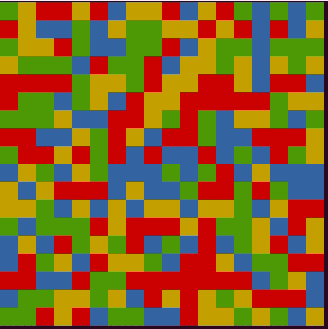

# Color Flood

Color Flood is a 2D coloring game where cells are colored by their neighbours spread.



## Game Rules

* The game board is of size M x N and is initialized with random colors.
* Each turn the player must choose a color and type it in (red (r), blue (b), green (g), yellow (y)).
* The top left cell is the starting cell.
* The new color (that the player chose) spreads to all the neighbors of the starting cell which have the same color as it does.
* To win, the board must be of one color at a maximum of 21 moves.
* The player loses if after 21 moves the board is not colored in a single color.


## Extra Features

1. Undo support:
    * When the user types the letter 'u', the board goes back to the previous state it was in.
    * The user can type 'u' as many times he wants and each time the board goes back a state.
    * When the board is in the initial state, typing 'u' should change nothing.
2. Knight move:
    * When the user types the letter 'k', the board toggles its state onward so the spreading algorithm uses knight moves instead of the regular up-down-right-left.
    * When the user types the letter 'k' the second time, the board switches back to the regular spreading algorithm.
3. Joker cells:
    * Initialize random cells to be used as special joker cells.
    * Each time a special joker cell is colored, it colors all of its direct neighbors regardless of their color.
    

## Usage
```
usage: game.py [-h] [-m] [-n] [-w --win-turns] [-c --colors] [-j --jokers]

Color Flood Game Configuration

optional arguments:
  -h, --help        show this help message and exit
  -m                Number of rows in the board
  -n                Number of columns in the board
  -w, --win-turns   Maximum number of turns to win
  -c, --colors      Game colors
  -j, --jokers      Number of joker cells
  ```


## Advanced

You may install the _Redis_  tool using `./install_redis.sh`, afterwards each game round's statistics will be dumped into it.
